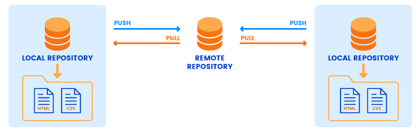
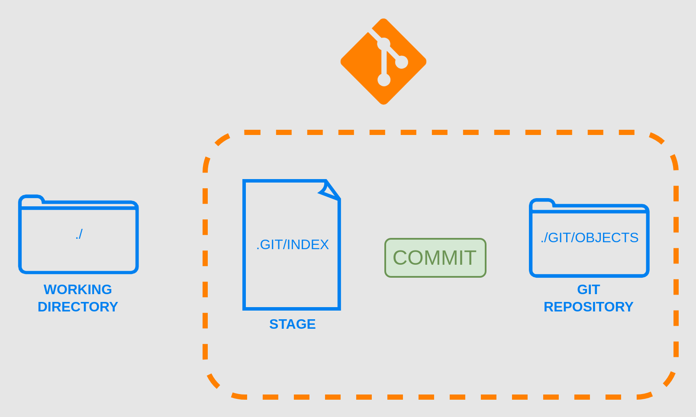
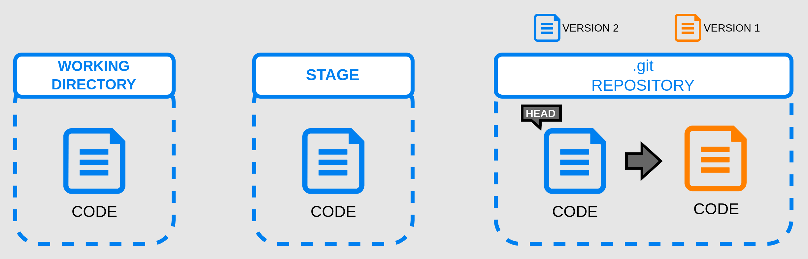

# git4nondev

This repository has the intention to be an student notebook about git processes and some notation about some repositories.

This is write by a non-dev to non-dev people.

---
## Index

1. What is git?
2. Git configuration;

---
## 1. What is Git?

Git is a program, created to version documents, that's is mostly used by developers, but can use by anyone that wants to version documents.

By the way, this document is version by git, stored on Github repository.

With git, a dev can control the version of the code, and syncronise the code on a remote server (repository), and work with others developers at the same time, in the same code.



On official site of [git](git-scm.com) it's possible to find the documentation, an official book and much more.

## 2. Git Configuration

There is some principal configuration that's needed to do before starting to use the git.

1. Name;

```sh
git config --global user.name "User Name"
```
2. E-mail;

```sh
git config --global user.email "user@email.com"
```

> :memo: **Note:** Use the `git config --global --list` command line to list the git configuration.

On these commands, there is something important to know, when it's shows `--global`, it's about the git program, if it's not specified, can be the list of all configurations (local and global) or can be the configuration of a local repository.

## 3. Creating or Clonning a Repository

First of all, you, dear non-dev reader, need to know that a repository is where the document versions will be stored.

**Creating a Repository**

To create a local repository, can be used this command line, inside the project folder:

```sh
git init
```

The response of this command will show the creation of .git folder inside our project folder.

**Cloning a Repository**

First step to clone an external repository is to have access to it.

The second think that we might know, is the way the clone will be donne. If it will be with HTTPS method or SSH method.

The difference is, when used HTTPS method, it will be necessary to input an user name and password to connect to the remote repository, when used SSH method, a SSH key will be stored on the remote repository, so it will not be necessary any interaction to clone or update the repository.

The method is declarated in the URL used to clone the repository. Just to exemplify, there is the two methods URLs to clone this repository:
- **HTTPS:** `https://github.com/leonardopangaio/git4nondev.git`
- **SSH:** `git@github.com:leonardopangaio/git4nondev.git`

To clone an external repository to local machine, can be used this command line, inside the folder that's wanted to have the project root folder:

```sh
git clone "repository url"
```

---
## 4. Workflow

It's important to say that all the code changes will be just on local machine, and it's not automatcaly syncronized to repository. The developer needs to "say to git" when it's time to syncronize all the changes to repository. 

The git workflow has 3 principal steps:
1. Local work direcory, where the app, or documentation, are coded;
    - Everything done here, it's just stored here;
2. Stage;
    - The stage step, is where git start to organize all the files and it's differences;
3. Git Repository;
    - This step the app files, or documents, are ready to be stored on the remote repository;
    - Once the new version is stored, it's considered that is the head file, or the last version of the file;





## 5. Add and Remove Files

Using the command `git add "file"` the file will be add on stage area.

If more than 1 file was changed, using the command `git status` command it'll be show the files that were changed and don't are in stage area.

> :bulb: **Tip:** If more than one file was changed, can be used `git add .` command to add all these files on stage area.

It's important to note that when a file is added on stage area and it has new changes, it will be show as a different version of file of stage area. To apply this new version, can be used `git reset "file"` command to refresh the file version on stage area. However if the intention is to restore the file on workdir to the version that's in stage area, can be used `gir restore "file"` command to do it.

This is an example of `git status` command output:
```log
No ramo main
Your branch is up to date with 'origin/main'.

Changes not staged for commit:
  (utilize "git add <arquivo>..." para atualizar o que será submetido)
  (use "git restore <file>..." to discard changes in working directory)
        modified:   README.md

Arquivos não monitorados:
  (utilize "git add <arquivo>..." para incluir o que será submetido)
        Attachments/

nenhuma modificação adicionada à submissão (utilize "git add" e/ou "git commit -a")
```

To show the differences between stage version and workdir version, the command line `git diff "file"` can be used. But it's highly recommended to use it on some IDE to make easier the visualization.

---
## 6. Commiting the Changes

The commit is the momment that all the changes will be signaled to the remote repository. It's like a photograph of file status on that moment.

The commit has 4 principal itens:
1. The file changes;
2. An unique identifyer (hash);
3. Metadata (e.g.: name or date of the change);
4. A message to improve the identification;

The commit it's too important to develop in a team, and to track changes.

To commit something, can be used `git commit -m "commit message"` command. Once the commit has been done, the stage area is cleared, and it's ready to recieve new files changes.

> :bulb: **Tip:** It's possible to simplify the process, like a shortcut, using just one command to add on stage and commit at the same time. This command line is `git commit -a -m "message"`.

> :warning: **Warning:** Using the `-a` parameter, it will add and commit all the changed files, even those that has no relation with the changed being made.

Another important parameter of `git commit` is the `--amend` that makes possible to "remake" the last commit done.

> :bulb: **Tip:** A good practice is to write a commit message that let other devs knows what was changeded without listing all the file differences. To make better messages or thinking about a standard way to write these messages, the [Conventional Commits](https://www.conventionalcommits.org/) is an usefull website.

---
## 7. Logs and History

The `git log` command is the CLI way to visualize the history of code changes. It has a lot of parameters to use, so it's recommended to read the [oficial documentation](https://git-scm.com/docs/git-log) to find the best combination.

:bulb: **Tip:** It's highly recommended to use it on some IDE to make easier the visualization.

To read the git commit log, the command line that can be used is `git log`. Using this command, all information about the commits will be show. 

An easier way to just list the commits of a repository is using `git log --oneline`.

One example of flter parameter can be `--author="Author Name"`.

Another simplified way to show the log is `git shortlog` command, that will show the repository authors, the amount of commits by author and the commits itself. Or if it's just needed to know the amount of commits by author, can be used `git shortlog -sn` command.

There is another kind of log on git called `git reflog` that shows all the actions made on repository, not necessarily just commits.


---
## References
- https://www.youtube.com/watch?v=ts-H3W1uLMM&list=WL&index=118
- https://en.wikipedia.org/wiki/Git
- https://git-scm.com/book/en/v2