# git4nondev

This repository has the intention to be an student notebook about git processes and some notation about some repositories.

This is write by a curious non-dev to non-dev people.

---
## Index
1. [What is git?](#1-What-is-Git?)
2. [Git configuration;](#2-Git-Configuration)
3. [Creating or Cloning a Repository;](#3-creating-or-cloning-a-repository)
4. [Workflow;](#4-Workflow)
5. [Add and Remove Files to Local Stage Area;](#5-Add-and-Remove-Files-to-Local-Stage-Area)
6. [Committing the Changes;](#6-committing-the-changes)
7. [Logs and History;](#7-Logs-and-History)
8. [Branches;](#8-Branches)
9. [External Repositories;](#9-External-Repositories)
10. [Update and Merge Branches;](#10-Update-and-Merge-Branches)
11. [Tags;](#11-Tags)
12. [Undoing Unwanted Changes;](#12-Undoing-Unwanted-Changes)
13. [Manipulating Commits Across Branches;](#13-Manipulating-Commits-Across-Branches)
14. [Branches Strategies;](#14-Branches-Strategies)
    - 14.1. [Gitflow;](#14.1-Gitflow)
    - 14.2. [Trunk Based Development (TBD);](#14.2-Trunk-Based-Development-TBD)
15. [Gitignore;](#15-Gitignore)
16. [Reverse;](#16-Reverse)
17. [Merge Request (MR) or Pull Request (PR);)](#17-Merge-Request-MR-or-Pull-Request-PR)
18. [Git Fetch;](#18-Git-Fetch)
19. [Management of SSH keys on different repositories;](#19-Management-of-SSH-keys-on-different-repositories)
20. [Git Reset, Restore and Rebase;](#20-Git-Reset-Restore-and-Rebase)
21. [Using Git with Microsoft Visual Studio Code (vscode);](#21-Using-Git-with-Microsoft-Visual-Studio-Code-vscode)
22. [References;](#References)

---
## 1. What is Git?

Git is a program, created to version documents, that's is mostly used by developers, but can use by anyone that wants to version documents.

By the way, this document is version by git, stored on Github repository.

With git, a dev can control the version of the code, and synchronize the code on a remote server (repository), and work with others developers at the same time, in the same code.

On official site of [git](git-scm.com) it's possible to find the documentation, an official book and much more.

## 2. Git Configuration

There is some principal configuration that's needed to do before starting to use the git.

1. Name;

```sh
git config --global user.name "User Name"
```

2. E-mail;

```sh
git config --global user.email "user@email.com"
```

> :memo: **Note:** Use the `git config --global --list` command line to list the git configuration.

On these commands, there is something important to know, when it's shows `--global`, it's about the git program, if it's not specified, can be the list of all configurations (local and global) or can be the configuration of a local repository.

## 3. Creating or Cloning a Repository

First of all, you, dear non-dev reader, need to know that a repository is where the document versions will be stored.

**Creating a Repository**

To create a local repository, can be used this command line, inside the project folder:

```sh
git init
```

The response of this command will show the creation of .git folder inside our project folder.

**Cloning a Repository**

First step to clone an external repository is to have access to it.

The second think that we might know, is the way the clone will be donne. If it will be with HTTPS method or SSH method.

The difference is, when used HTTPS method, it will be necessary to input an user name and password to connect to the remote repository, when used SSH method, a SSH key will be stored on the remote repository, so it will not be necessary any interaction to clone or update the repository.

The method is declared in the URL used to clone the repository. Just to exemplify, there is the two methods URLs to clone this repository:
- **HTTPS:** `https://github.com/leonardopangaio/git4nondev.git`
- **SSH:** `git@github.com:leonardopangaio/git4nondev.git`

To clone an external repository to local machine, can be used this command line, inside the folder that's wanted to have the project root folder:

```sh
git clone "repository url"
```

> :memo: **Note:** To clone an external repository using ssh method, it's necessary to add the public ssh key on repository. This ssh key depends on which repository it's used. [Here](#19-Management-of-SSH-keys-on-different-repositories) is a list of some reference urls for creating ssh keys.

---
## 4. Workflow

It's important to say that all the code changes will be just on local machine, and it's not automatically synchronized to repository. The developer needs to "say to git" when it's time to synchronize all the changes to repository. 

The git workflow has 3 principal steps:
1. Local work directory, where the app, or documentation, are coded;
    - Everything done here, it's just stored here;
2. Stage;
    - The stage step, is where git start to organize all the files and it's differences;
3. Git Repository;
    - This step the app files, or documents, are ready to be stored on the remote repository;
    - Once the new version is stored, it's considered that is the head file, or the last version of the file;


This is the principle of git workflows, but there are some frameworks that helps manage repositories, specially to large teams. In this article there'll be described the two principals frameworks: [GitFlow](#14-Gitflow) and [Trunk Based Dev](#15-Trunk-Based-Development).

## 5. Add and Remove Files to Local Stage Area

Using the command `git add "file"` the file will be add on stage area.

If more than 1 file was changed, using the command `git status` command it'll be show the files that were changed and don't are in stage area.

> :bulb: **Tip:** If more than one file was changed, can be used `git add .` command to add all these files on stage area.

It's important to note that when a file is added on stage area and it has new changes, it will be show as a different version of file of stage area. To apply this new version, can be used `git reset "file"` command to refresh the file version on stage area. However if the intention is to restore the file on workdir to the version that's in stage area, can be used `gir restore "file"` command to do it.

This is an example of `git status` command output:
```log
No ramo main
Your branch is up to date with 'origin/main'.

Changes not staged for commit:
  (utilize "git add <arquivo>..." para atualizar o que será submetido)
  (use "git restore <file>..." to discard changes in working directory)
        modified:   README.md

Arquivos não monitorados:
  (utilize "git add <arquivo>..." para incluir o que será submetido)
        Attachments/

nenhuma modificação adicionada à submissão (utilize "git add" e/ou "git commit -a")
```

To show the differences between stage version and workdir version, the command line `git diff "file"` can be used. But it's highly recommended to use it on some IDE to make easier the visualization.

---
## 6. Committing the Changes

The commit is the moment that all the changes will be signaled to the remote repository. It's like a photograph of file status on that moment.

The commit has 4 principal itens:
1. The file changes;
2. An unique identifier (hash);
3. Metadata (e.g.: name or date of the change);
4. A message to improve the identification;

The commit it's too important to develop in a team, and to track changes.

To commit something, can be used `git commit -m "commit message"` command. Once the commit has been done, the stage area is cleared, and it's ready to receive new files changes.

> :bulb: **Tip:** It's possible to simplify the process, like a shortcut, using just one command to add on stage and commit at the same time. This command line is `git commit -a -m "message"`.

> :warning: **Warning:** Using the `-a` parameter, it will add and commit all the changed files, even those that has no relation with the changed being made.

Another important parameter of `git commit` is the `--amend` that makes possible to "remake" the last commit done.

> :bulb: **Tip:** A good practice is to write a commit message that let other devs knows what was changed without listing all the file differences. To make better messages or thinking about a standard way to write these messages, the [Conventional Commits](https://www.conventionalcommits.org/) is an useful website.

---
## 7. Logs and History

The `git log` command is the CLI way to visualize the history of code changes. It has a lot of parameters to use, so it's recommended to read the [oficial documentation](https://git-scm.com/docs/git-log) to find the best combination.

:bulb: **Tip:** It's highly recommended to use it on some IDE to make easier the visualization.

To read the git commit log, the command line that can be used is `git log`. Using this command, all information about the commits will be show. 

An easier way to just list the commits of a repository is using `git log --oneline`.

One example of filter parameter can be `--author="Author Name"`.

Another simplified way to show the log is `git shortlog` command, that will show the repository authors, the amount of commits by author and the commits itself. Or if it's just needed to know the amount of commits by author, can be used `git shortlog -sn` command.

There is another kind of log on git called `git reflog` that shows all the actions made on repository, not necessarily just commits.

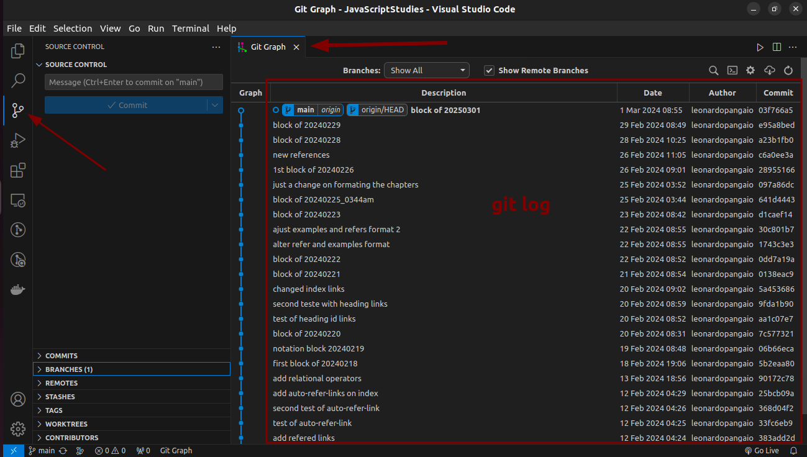
*Here is an example of `git log` on VSCode using Git Graph Extension.*

---
## 8. Branches

The branch concept is one of the most important in the git context.

The branch can be understand as different versions, or replicas of the code, coexisting simultaneously. It gives to the developer the security to code without change the principal code.

The branch can be organized in different ways, depending on project, environment, feature and other classifications that the team or organization defines. For example, in a project can exist 3 principal branches, one to production environment, other for homologation env and other to development env.

Here is a simple git graph diagram:
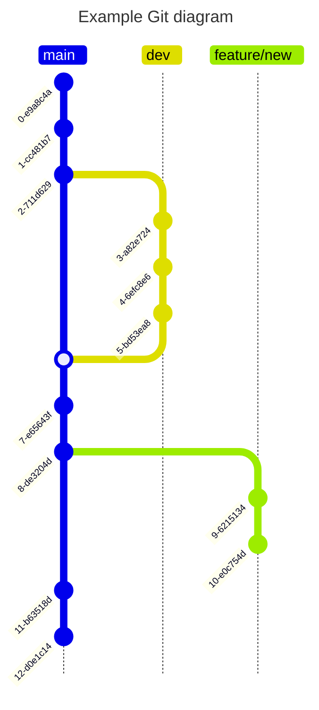

The principal branch usually is called main or master.

It's possible to have how many branches are it's necessary, and so there is many commands to administrate all the branches. Commands to navigate between the branches, commands to unify/merge different branches, etc...

To create a new branch, can be used this command line `git branch "BranchName"`. On this example, the branch just was created, but not set as the used branch.

A suggest is to create the branch with the command `git checkout -b "BranchName"`, with this code, the branch is created and setup as the used branch.

To remove a branch, the command `git branch -D "BranchName"` can be used.

To navigate between the branches, the command `git checkout "BranchName"` can be used.

It's possible to rename a branch using `git branch -m "NewBranchName"` once the branch thats will be renamed is active.

> :memo: **Note:** There is a huge sort of commands to administrate the branches of a project. It's highly recommended to search the command depending on the necessity.

---
## 9. External Repositories

The external repositories are services that store the versioned code in a remote server.

Plataformas like GitHub, GitLab, Bitbucket, Azure Devops and so many others, works as a external storage to store the versioned code.

To send the local repository to external, the command `git push` can be used. This command upload all the files of the current commit to the remote repository.

To retrieve the remote repository to local, the command `git pull` can be used. This command download all the files of the remote repository to local one. Here can be used too the command `git pull rebase` that recreate the local repository comparing to remote one, it's like to remove the local repository and clone it again.


> :memo: **Note:** The `origin` term is referred to URL of the remote repository. If we run the command line `git remote -v` we will see that origin is an alias to the repository URL. Quick reference [here](https://stackoverflow.com/questions/9529497/what-is-origin-in-git).

An interesting command to list the information about the remote repository is `git remote show origin`. It'll shows information about origin, branches, and some other information.

If the remote repository changed the URL, it's possible to adjust on local repository with the command line `git remote set-url origin "NewRemoteRepositoryURL"`.

There is another way to get the remote repository data to local, that's using the command `git fetch`. The principal difference between `git fetch` and `git pull` it's that `git pull` will get the remote data and update local repository and working directory, and `git fetch` will only get the remote repository data to local repository, it'll not update the working directory. 

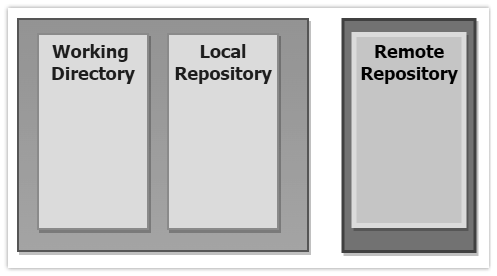

> :memo: **Note:** Quick reference [here](https://www.theserverside.com/blog/Coffee-Talk-Java-News-Stories-and-Opinions/Git-pull-vs-fetch-Whats-the-difference).

---
## 10. Update and Merge Branches

After all the work in the project, on different branches, it's time to unify the main and the other branch. In this case, can be used the command `git merge "BranchName"` inside the `main/master` branch.

If there are merge conflicts, there is two default ways to proceed, 1st is to use `git merge --abort` to cancel de merge, adjust the code and merge again the code, or the code can be adjusted and runs the `git merge --continue` command line.

The other way to merge two different branches is using the `rebase` command, on that way, the second branch will be updated with the last commits of main/master. It's like all the commits from a branch were copied to another branch.

This example will update new_feature with the last commits from the main/master:

```git
git checkout new_feature
git rebase main
```

In this example, we should have this kind of change, between branches:
|Before Rebase|After Rebase|
|-------------|------------|
|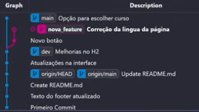|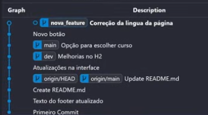|

It can be done for both sides, other branches -> main/master or main/master -> other branches.

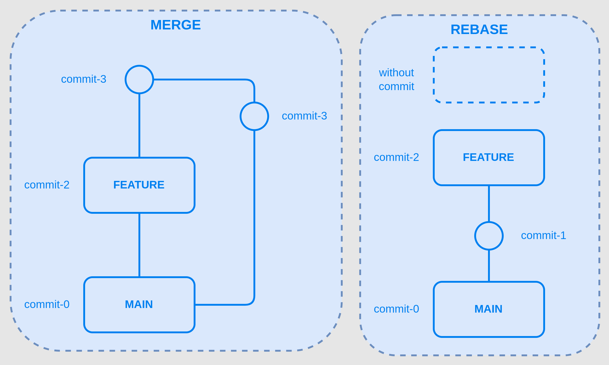

Another way to understand the difference between then is to think that `git commit` will preserve all the history and order of the commits, and the `git rebase` will make a linear history of all commits.

> :memo: **Note:** The conflict handle is similar than the merge method. Can be used `git rebase --abort` to cancel the rebase or used `git rebase --continue` to try again after the conflicts were fixed.

---
## 11. Tags

They are just like labels to the commits, to make easier to find some commits. Usually used to identify the specific commits that will be deployed or it's in homologation fase.

The tags are different of branches, because branches are mutable, and tags are not.

There are two types of tag, `lightweight` and `annotated`. Here is the [official description](https://git-scm.com/docs/git-tag) of then:

> "Tag objects [...] are called "annotated" tags; they contain a creation date, the tagger name and e-mail, a tagging message, and an optional GnuPG signature. Whereas a "lightweight" tag is simply a name for an object (usually a commit object)."

Usually the lightweight tags are used to simple mark a specific commit, and the annotated tags are used to identify a specific version.

To add a lightweight tag, the command line is `git tag "TagName"`, and to remove, from local repository the command line is `git tag -d "TagName"`, and the command line to remove a tag from remote repository is `git push origin --delete "TagName"`.

There is two principal forms to create an annotated tag, 1st is with the command line `git tag -a "TagName" -m "Message"` and 2nd way is with the command `git tag -s "TagName" -m "Message"`. The difference between then is the parameter `-s`, or could be `-u "key_id"`, of signature, in these cases, it's needed to configure the method, or pass the key_id, that git will assign this tag.

> :memo: **Note:** All the tags are displayed on git history log.

Similar to branches or commits, the tags can be pushed to remote repository too, with the command line `git push origin "TagName"`.

Some examples of tag utilization are release versions, control points and integrity and verification.

---
## 12. Undoing Unwanted Changes

One of the main functions of git is to undo non-wanted changes or actions on code or repository.

1. `git checkout -- "FileName"`: This command line will return the local repository status to before the change. It's possible because was not put on stage area and it was an uncommitted change;

2. `git reset --hard HEAD`: This command line will return the stage area to before the change. It's possible because was an uncommitted change;

3. `git reset --hard HEAD-1`: This command line will return the local commit to before the change. It's possible because was an uncommitted change on remote repository;

4. `git commit --amend`: This command line will open an separated editor to re-do the commit, after necessary manual code fix, and it enables the creation of a new message;

5. `git reverse "CommitID"`: This command line will create a new commit without the changes on the commit declared by "CommitID". It's useful when the entire commit will be "reversed", ignoring all the changes inside it. Note that this command will reverse just local repository, to force the reverse on remote repository will be necessary use the `git push origin "BranchName" --force` command line;

6. Imagine a scenario where the developer wrote some code and notice that wrote everything on a main/master branch. There is an way to fix that with some command lines:
    ```sh
    git stash
    git checkout -b "NewBranchName"
    git stash pop
    ```
    - Explaining the commands:
        - `git stash` will create a temporary area to store the code changes that are not staged or committed;
        - `git checkout -b "NewBranchName"` will create a new branch and enter on it;
        - `git stash pop` will apply the changes, that are temporary stored on stash space, on the current branch;

7. A scenario that it's needed to remove a file from a repository, but it cannot be on the history, for example, if credentials file were pushed to remote repository. The necessary steps are:
    - Lets use the rebase interactive method to edit our commit, to do this, it'll be necessary know the commit id before the desired commit that will be changed;
    - With this command line`git rebase -i "commit_id"` will open a text editor displaying a list of the branch’s commits from the specified commit to the current one;
    - Lets chose the commit that will be changed, and alter the text to edit, save and close the editor;
    - Now it's possible to remove the desired file;
    - Add the changes to stage with `git add .` command line;
    - Continue the rebase with `git rebase --continue`;
    - Confirme the new commit;
    - Push to origin the commit edited with `git push origin main --force`;

For some other scenarios, a good refer is this [article](https://www.abrahamberg.com/blog/git-remove-commits-from-branch-after-push-reset-revert-or-rebase/).

---
## 13. Manipulating Commits Across Branches

There is a possibility to use a commit from one branch into another branch, using the [`cherry-pick`](https://git-scm.com/docs/git-cherry-pick) method.

The cherry-pick copy a commit from other branch to the current branch.

- e.g.:
    ```sh
    git cherry-pick "commit_ID"
    ```

---
## 14. Branches Strategies

There are some methods practiced by the development teams, like Trunk-Based Development, Feature branches or GitHub Flow, Forking strategy, Release branches, Git Flow, Environment branches, however we'll work on the two most common ones, GitFlow and Trunk-Based Development, in this article.

### 14.1. Gitflow

First of them are GitFlow, thats recommended to an open-source project, a junior development team or an established product. This git strategy is usually used on large teams, and it's more complex than other strategies because the number of branches in a single project.

1. **Main Branches:**

   - **Master Branch:** This is like the final version of your project. It's the branch where your stable, production-ready code lives. Only code that is thoroughly tested and ready for release should be merged into the master branch. Usually the main/master branch is the production branch.
   
   - **Develop Branch:** Think of this as the playground for your ongoing work. It's where all the development happens. When you start a new feature or fix a bug, you branch off from here. It's a reflection of the latest state of development.

2. **Support Branches:**

   - **Feature Branches:** Whenever you're working on a new feature or enhancement, you create a new branch off of "develop". This is where you do all your work for that specific feature. Once the feature is complete, it gets merged back into "develop".
   
   - **Release Branches:** When it's time to prepare for a new release, you create a new branch off of "develop". This is where you do final testing, bug fixing, and any last-minute changes specific to the release. Once everything is ready, this branch gets merged into both "master" and "develop".
   
   - **Hotfix Branches:** If a critical bug is found in production code (in the "master" branch), you create a new branch off of "master" to fix it immediately. This allows you to address the issue without disrupting ongoing development in the "develop" branch. Once fixed, this branch gets merged into both "master" and "develop".

This setup ensures that your development process is organized and controlled. It helps separate ongoing work from stable code, making it easier to manage and release updates.

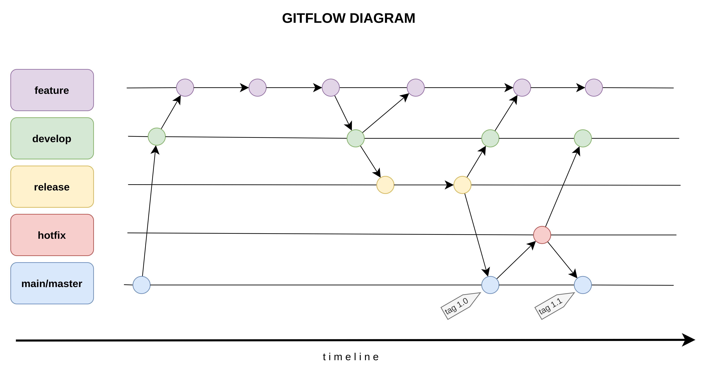

### 14.2. Trunk Based Development (TBD)

In the [trunk-based development](https://trunkbaseddevelopment.com/) framework, all developers work on a single branch with open access to it. Often it’s simply the master branch or trunk branch. They commit code to it and run it. In scaled trunk-based, can be created short-lived feature branches. Once code on their branch compiles and passes all tests, they merge it straight to master/trunk. It ensures that development is truly continuous and prevents developers from creating merge conflicts that are difficult to resolve.

It's highly recommended to use feature flags or feature toggles in this method. To decouple deployment from release, TBD often utilizes feature flags. Feature flags allow developers to deploy code to production while keeping it hidden behind a flag until it's ready to be released. This enables teams to continuously deliver new features without disrupting users.

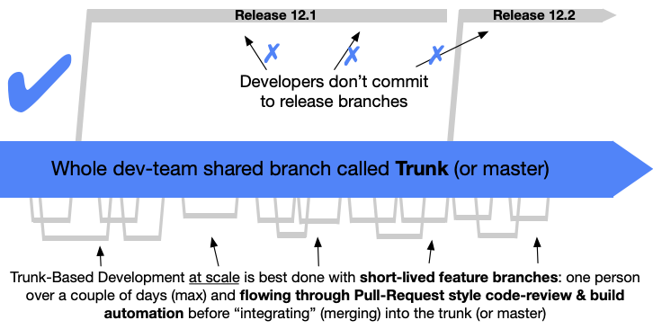

### Reference urls

- [Git Flow // Dicionário do Programador (pt-br)](https://youtu.be/oweffeS8TRc?si=HzIIqost-rMoqqvb)
- [VERSIONAMENTO DE CÓDIGO: ENTENDENDO GITFLOW E TRUNK BASED DEVELOPMENT (pt-br)](https://youtu.be/qKgiyJl_x_A?si=4NxFtJz8DRLhpRcX)
- [Branching Strategies Explained (en)](https://youtu.be/U_IFGpJDbeU?si=zqrTteQh9QfdsUJO)
- [Trunk-based Development vs. Git Flow (en)](https://www.toptal.com/software/trunk-based-development-git-flow)
- [Trunk Based Development (pt-br)](https://medium.com/@mateusdecampos/trunk-based-development-1770f5e0dfc1)
- [Official Trunk-Based Development site (en)](https://trunkbaseddevelopment.com/)
- [Trabalhando em equipe com Git Flow (pt-br)](https://youtu.be/394mc6PV8t8?si=PCj281FyBqR7Ifcm)

---
## 15. Gitignore

The file [.gitignore](https://git-scm.com/docs/gitignore) is a file that will be listed all files or folders that will be ignored to git tracking, i.e., the files or folders listed on .gitignore wont be tracked by git, so it'll not be staged, committed or pushed to remote repository.

The official description is:
> A gitignore file specifies intentionally untracked files that Git should ignore. Each line in a gitignore file specifies a pattern.

---
## 16. Reverse

The [`git reverse`](https://git-scm.com/docs/git-revert) command reverse a sigle commit or a group of commits. It'll will create a new commit reversing the passed commit.

---
## 17. Merge Request (MR) or Pull Request (PR)

Pull requests, also known as merge requests on other repository systems, are requests made by a repository collaborator to merge it's own branch to another branch, usually master/main or trunk. The PR (or MR) are used to make a code review with others developers before changes are merged on main/master branch, ensuring the quality and consistency of source-code.

There is no command, on git, to make the PR/MR, they are made on repository administrative tool, there will be the option to open a pull request, where it's necessary to choose the source branch (that will be merged) and the destination branch (that will receive the changes).

---
## 18. Git Fetch

The [`git fetch`](https://git-scm.com/docs/git-fetch) command is used to recover commits, branches and tags from a remote repository to local repository. It doesn't make any changes on local work directory or local files. Instead of, it update the remote referencies (like origin/master) on local repository, to compare local commits with remote commits. This allows to see whats was changed on remote repository since the last local synchronization.

---
## 19. Management of SSH keys on different repositories

Here goes a list with how to generate and add the ssh keys to principals commercials repositories.

- **GitHub**
    - Reference url: https://docs.github.com/en/authentication/connecting-to-github-with-ssh/adding-a-new-ssh-key-to-your-github-account
- **GitLab**
    - Reference url: https://docs.gitlab.com/ee/user/ssh.html
- **Azure DevOps**
    - Reference url: https://learn.microsoft.com/en-us/azure/devops/repos/git/use-ssh-keys-to-authenticate?view=azure-devops
- **Bitbucket**
    - Reference url: https://support.atlassian.com/bitbucket-cloud/docs/configure-ssh-and-two-step-verification/

## 20. Git Reset, Restore and Rebase

Certainly! Let's break down each concept:

1. **[Git Reset](https://git-scm.com/docs/git-reset)**:
   - `git reset` is a command used to reset the current state of the repository to a specific point in history.
   - It is primarily used to undo changes in your working directory, staging area, or commit history.
   - There are three main flags used with `git reset`: `--soft`, `--mixed`, and `--hard`, each indicating different levels of reset.
     - `--soft` resets the HEAD to a previous commit, keeping the changes in your working directory and staging area.
     - `--mixed` resets the HEAD and the staging area to a previous commit, keeping the changes in your working directory.
     - `--hard` resets the HEAD, staging area, and working directory to a previous commit, discarding all changes.

2. **[Git Restore](https://git-scm.com/docs/git-restore)**:
   - `git restore` is a command used to restore files in your working directory to their state at a specific commit or to discard changes.
   - It's used to selectively restore files or directories to a previous state without affecting the staging area or commit history.
   - Similar to `git checkout`, `git restore` can be used to undo modifications to files.

3. **[Git Rebase](https://git-scm.com/docs/git-rebase)**:
   - `git rebase` is a command used to reapply commits on top of another base commit.
   - It's often used to integrate changes from one branch into another by moving or combining a sequence of commits onto a new base commit.
   - Rebase essentially rewrites the commit history of a branch, which can result in a cleaner and more linear history compared to merging.
   - It's particularly useful for maintaining a clean history when working in feature branches or collaborating with others.

**Differences**:

- **Purpose and Scope of Changes**:
  - `git reset` is primarily used to move the HEAD and/or update the staging area and working directory. It can be used to reset changes at different levels (commit, staging area, working directory) depending on the flags used.
  - `git restore` is used to restore files in the working directory to a previous state without affecting the staging area or commit history. It operates on the working directory, selectively restoring files or discarding changes.
  - `git rebase` is used to reapply commits onto a new base commit, typically used for integrating changes from one branch into another. It involves restructuring the commit history of a branch, applying commits onto a new base.

- **Effect on Commit History**:
  - `git reset` and `git restore` do not directly modify the commit history. They affect the working directory and staging area.
  - `git rebase` rewrites the commit history by applying commits on top of another base commit, potentially altering the commit history of a branch.

In summary, `git reset` is for manipulating the state of the repository, `git restore` is for selectively restoring files, and `git rebase` is for integrating changes from one branch to another while maintaining a clean commit history.

> :warning: **Warning:** The 'drop' option in interactive rebase allows you to remove a specific commit from your branch's history. This means that the commit and all its associated changes will not be included in the new baseline being created during the rebase. Git not only removes the commit from the baseline but also eliminates any associated changes from the local working directory. This means that the changes introduced by that commit will no longer be present in your project's files.

---
## 21. Using Git with Microsoft Visual Studio Code (vscode)

It's not common use git with CLI commands,  usually it's used with some IDE/Dev Tool.

Here will be some simples steps to use git on vscode to version the code.

First of all, the code files needs to be saved to get shown on Source Control area;

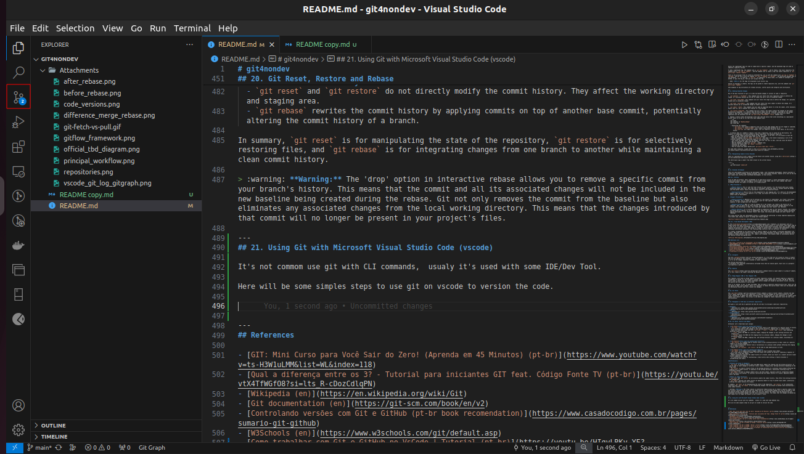
*Source controls showing that there are 2 changes.*

On Source Control area, there is some principal itens that let us make an easy way to control whats will committed and pushed to remote repository.

1. Its the Stage Area, where we can choose which files will be inserted on the commit;
2. The commit message;
3. Commit it-self;

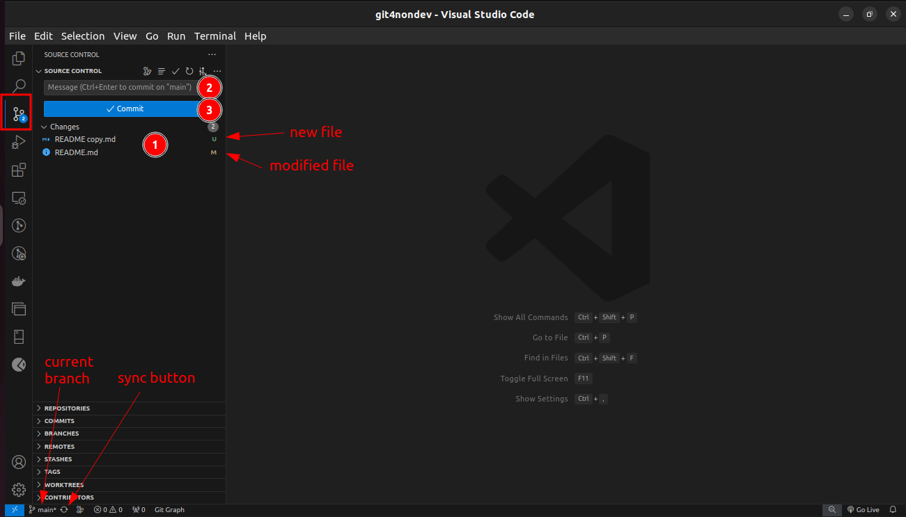
*Source Control interface with changes and options.*

If we want, to add to commit, just a couple of files, not all, we can choose the desired files and add it to stage for the commit.

Although if we whish to commit all the files and changes, we can just create a commit message and commit it.

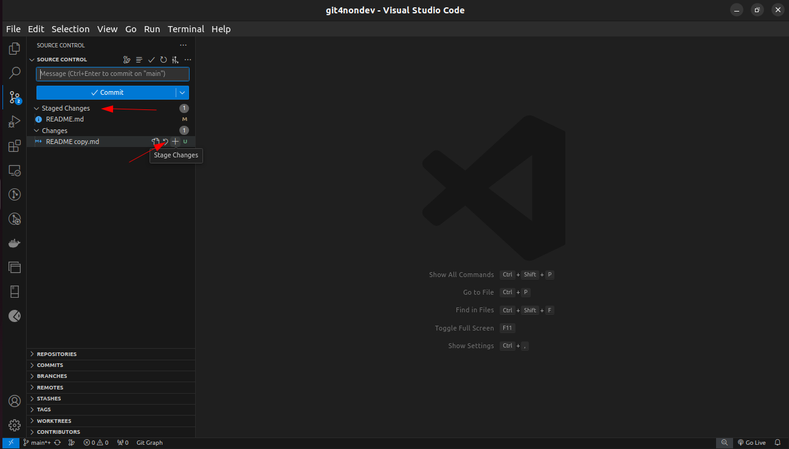
*Choosing the changes to add on stage area.*

Here, on Source Control area, there is a lot of git commands to simplify the code version control.

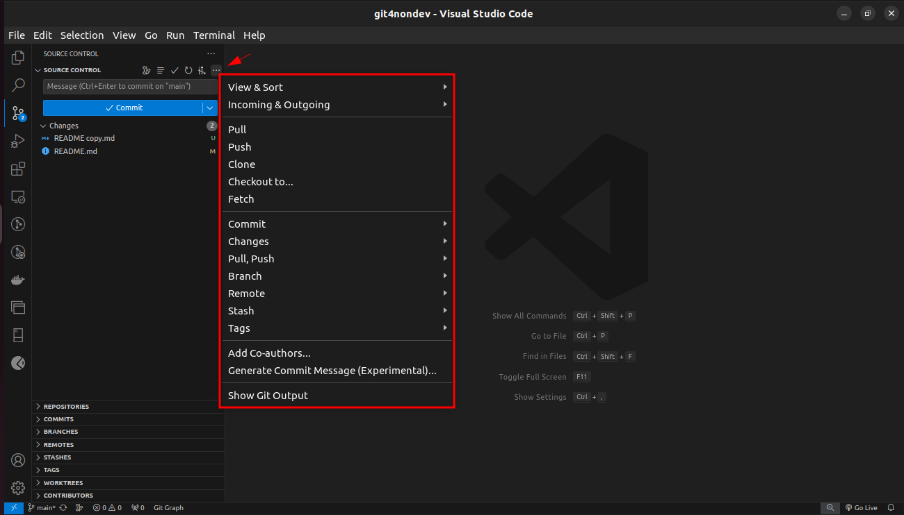
*Git options*

After that, lets write some commit message. This message is extremely important to let all the other devs, and our-selves, whats the changes were made on that commit.

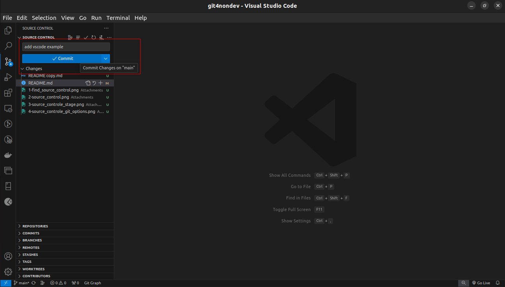
*Commit message and commit the change*

After the commit, lets sync/push the commit to remote repository.

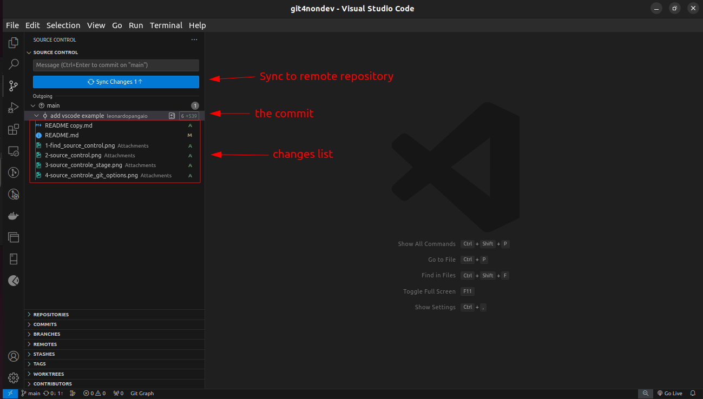
*The commit that will be synced and the branch that will receive the commit.*

Now it's possible to see the git history log using an external vscode extension called Git Graph. It's highly recommended to install this extension on vscode to simplify the job of see the git history.

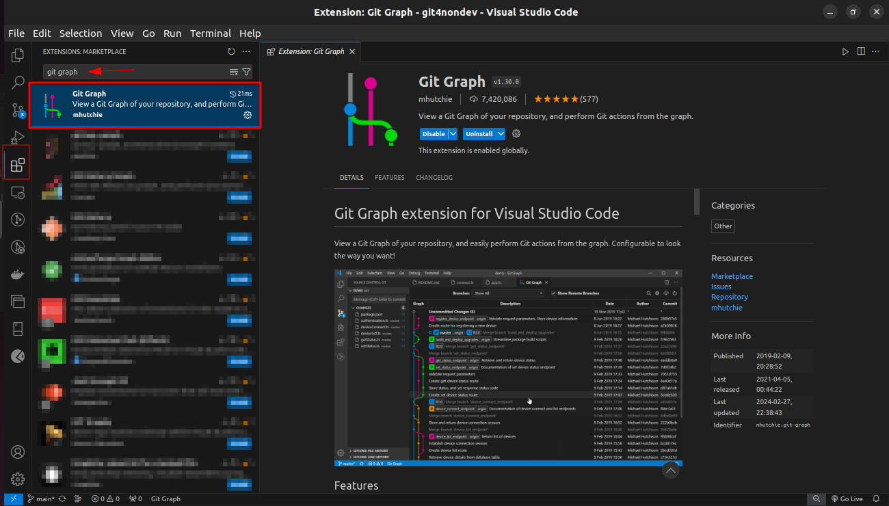
*Installing the Git Graph Extension.*

After the previous installation, the git log is friendly showed with some diagrams.

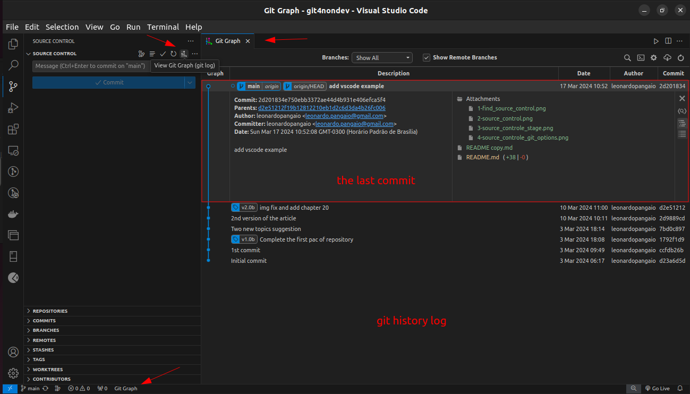
*Git history log.*

---
## References

- [GIT: Mini Curso para Você Sair do Zero! (Aprenda em 45 Minutos) (pt-br)](https://www.youtube.com/watch?v=ts-H3W1uLMM&list=WL&index=118)
- [Qual a diferença entre os 3? - Tutorial para iniciantes GIT feat. Código Fonte TV (pt-br)](https://youtu.be/vtX4TfWGfO8?si=lts_R-cDozCdlqPN)
- [Wikipedia (en)](https://en.wikipedia.org/wiki/Git)
- [Git documentation (en)](https://git-scm.com/book/en/v2)
- [Controlando versões com Git e GitHub (pt-br book recommendation)](https://www.casadocodigo.com.br/pages/sumario-git-github)
- [W3Schools (en)](https://www.w3schools.com/git/default.asp)
- [Como trabalhar com Git e GitHub no VsCode | Tutorial (pt-br)](https://youtu.be/HIqyLRKv-YE?si=hrC1_n439chqvXd-)
- [Como trabalhar com GIT e GITHUB | Parte I (pt-br)](https://youtu.be/Ckig8H_h538?si=Wenh2iE3wyOLMvyo)
- [Como trabalhar com GIT e GITHUB | Parte II (pt-br)](https://youtu.be/o_ECnZ8zk_Q?si=b4vvdhiiWwNZxVTr)
- [Git for Professionals Tutorial - Tools & Concepts for Mastering Version Control with Git (en)](https://youtu.be/Uszj_k0DGsg?si=kY9yR7WKVMa8iZYc)