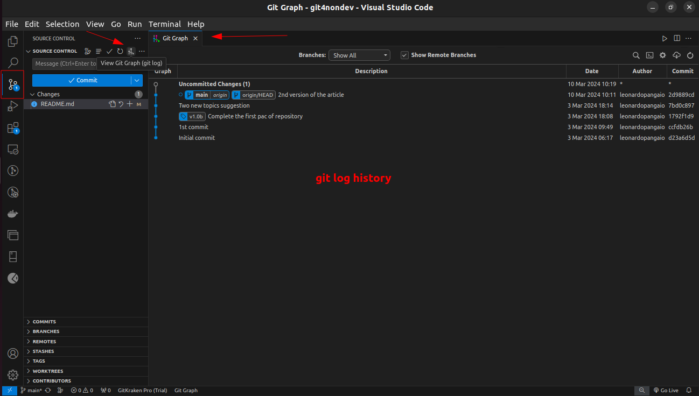
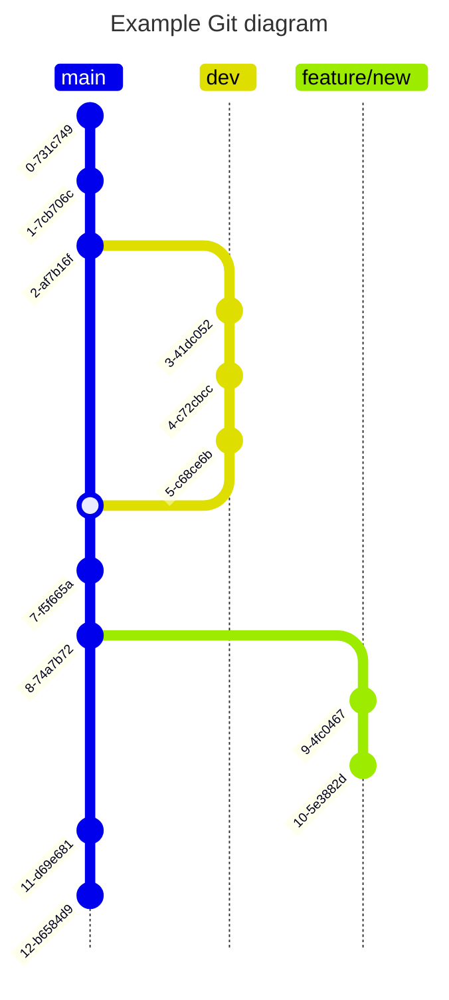

# git4nondev

This repository has the intention to be an student notebook about git processes and some notation about some repositories.

This is write by a non-dev to non-dev people.

---
## Index

1. [What is git?](#1-What-is-Git?)
2. [Git configuration;](#2-Git-Configuration)
3. [Creating or Clonning a Repository;](#3-Creating-or-Clonning-a-Repository)
4. [Workflow;](#4-Workflow)
5. [Add and Remove Files to Local Stage Area;](#5-Add-and-Remove-Files-to-Local-Stage-Area)
6. [Commiting the Changes;](#6-Commiting-the-Changes)
7. [Logs and History;](#7-Logs-and-History)
8. [Branches;](#8-Branches)
9. [External Repositories;](#9-External-Repositories)
10. [Update and Merge Branches;](#10-Update-and-Merge-Branches)
11. [Tags;](#11-Tags)
12. [Undoing Unwanted Changes;](#12-Undoing-Unwanted-Changes)
13. [Manipulating Commits Across Branches;](#13-Manipulating-Commits-Across-Branches)
14. [References;](#References)

---
## 1. What is Git?

Git is a program, created to version documents, that's is mostly used by developers, but can use by anyone that wants to version documents.

By the way, this document is version by git, stored on Github repository.

With git, a dev can control the version of the code, and syncronise the code on a remote server (repository), and work with others developers at the same time, in the same code.

On official site of [git](git-scm.com) it's possible to find the documentation, an official book and much more.

## 2. Git Configuration

There is some principal configuration that's needed to do before starting to use the git.

1. Name;

```sh
git config --global user.name "User Name"
```
2. E-mail;

```sh
git config --global user.email "user@email.com"
```

> :memo: **Note:** Use the `git config --global --list` command line to list the git configuration.

On these commands, there is something important to know, when it's shows `--global`, it's about the git program, if it's not specified, can be the list of all configurations (local and global) or can be the configuration of a local repository.

## 3. Creating or Clonning a Repository

First of all, you, dear non-dev reader, need to know that a repository is where the document versions will be stored.

**Creating a Repository**

To create a local repository, can be used this command line, inside the project folder:

```sh
git init
```

The response of this command will show the creation of .git folder inside our project folder.

**Cloning a Repository**

First step to clone an external repository is to have access to it.

The second think that we might know, is the way the clone will be donne. If it will be with HTTPS method or SSH method.

The difference is, when used HTTPS method, it will be necessary to input an user name and password to connect to the remote repository, when used SSH method, a SSH key will be stored on the remote repository, so it will not be necessary any interaction to clone or update the repository.

The method is declarated in the URL used to clone the repository. Just to exemplify, there is the two methods URLs to clone this repository:
- **HTTPS:** `https://github.com/leonardopangaio/git4nondev.git`
- **SSH:** `git@github.com:leonardopangaio/git4nondev.git`

To clone an external repository to local machine, can be used this command line, inside the folder that's wanted to have the project root folder:

```sh
git clone "repository url"
```

---
## 4. Workflow

It's important to say that all the code changes will be just on local machine, and it's not automatcaly syncronized to repository. The developer needs to "say to git" when it's time to syncronize all the changes to repository. 

The git workflow has 3 principal steps:
1. Local work direcory, where the app, or documentation, are coded;
    - Everything done here, it's just stored here;
2. Stage;
    - The stage step, is where git start to organize all the files and it's differences;
3. Git Repository;
    - This step the app files, or documents, are ready to be stored on the remote repository;
    - Once the new version is stored, it's considered that is the head file, or the last version of the file;


## 5. Add and Remove Files to Local Stage Area

Using the command `git add "file"` the file will be add on stage area.

If more than 1 file was changed, using the command `git status` command it'll be show the files that were changed and don't are in stage area.

> :bulb: **Tip:** If more than one file was changed, can be used `git add .` command to add all these files on stage area.

It's important to note that when a file is added on stage area and it has new changes, it will be show as a different version of file of stage area. To apply this new version, can be used `git reset "file"` command to refresh the file version on stage area. However if the intention is to restore the file on workdir to the version that's in stage area, can be used `gir restore "file"` command to do it.

This is an example of `git status` command output:
```log
No ramo main
Your branch is up to date with 'origin/main'.

Changes not staged for commit:
  (utilize "git add <arquivo>..." para atualizar o que será submetido)
  (use "git restore <file>..." to discard changes in working directory)
        modified:   README.md

Arquivos não monitorados:
  (utilize "git add <arquivo>..." para incluir o que será submetido)
        Attachments/

nenhuma modificação adicionada à submissão (utilize "git add" e/ou "git commit -a")
```

To show the differences between stage version and workdir version, the command line `git diff "file"` can be used. But it's highly recommended to use it on some IDE to make easier the visualization.

---
## 6. Commiting the Changes

The commit is the momment that all the changes will be signaled to the remote repository. It's like a photograph of file status on that moment.

The commit has 4 principal itens:
1. The file changes;
2. An unique identifyer (hash);
3. Metadata (e.g.: name or date of the change);
4. A message to improve the identification;

The commit it's too important to develop in a team, and to track changes.

To commit something, can be used `git commit -m "commit message"` command. Once the commit has been done, the stage area is cleared, and it's ready to recieve new files changes.

> :bulb: **Tip:** It's possible to simplify the process, like a shortcut, using just one command to add on stage and commit at the same time. This command line is `git commit -a -m "message"`.

> :warning: **Warning:** Using the `-a` parameter, it will add and commit all the changed files, even those that has no relation with the changed being made.

Another important parameter of `git commit` is the `--amend` that makes possible to "remake" the last commit done.

> :bulb: **Tip:** A good practice is to write a commit message that let other devs knows what was changeded without listing all the file differences. To make better messages or thinking about a standard way to write these messages, the [Conventional Commits](https://www.conventionalcommits.org/) is an usefull website.

---
## 7. Logs and History

The `git log` command is the CLI way to visualize the history of code changes. It has a lot of parameters to use, so it's recommended to read the [oficial documentation](https://git-scm.com/docs/git-log) to find the best combination.

:bulb: **Tip:** It's highly recommended to use it on some IDE to make easier the visualization.

To read the git commit log, the command line that can be used is `git log`. Using this command, all information about the commits will be show. 

An easier way to just list the commits of a repository is using `git log --oneline`.

One example of flter parameter can be `--author="Author Name"`.

Another simplified way to show the log is `git shortlog` command, that will show the repository authors, the amount of commits by author and the commits itself. Or if it's just needed to know the amount of commits by author, can be used `git shortlog -sn` command.

There is another kind of log on git called `git reflog` that shows all the actions made on repository, not necessarily just commits.

Here is an example of `git log` on VSCode using Git Graph Extension.


---
## 8. Branches

The branch concept is one of the most important in the git context.

The branch can be understand as different versions, or replicas of the code, coexisting simultaneously. It gives to the developer the security to code without change the principal code.

The branch can be organized in differente ways, depending on project, environment, feature and other classifications that the team or organization defines. For example, in a project can exist 3 principal branches, one to production environment, other for homologation env and other to development env.

Here is a simple gitgraph diagram:


The principal branch usualy is called main or master.

It's possible to have how many branches are it's necessary, and so there is many commands to administrate all the branches. Commands to navegate between the branches, commands to unify/merge differente branches, etc...

To create a new branch, can be used this command line `git branch "BranchName"`. On this example, the branch just was created, but not set as the used branch.

A suggest is to create the branch with the command `git checkout -b "BranchName"`, with this code, the branch is created and setup as the used branch.

To remove a branch, the command `git branch -D "BranchName"` can be used.

To navegate between the branches, the command `git checkout "BranchName"` can be used.

It's possible to rename a branch using `git branch -m "NewBranchName"` once the branch thats will be renamed is active.

> :memo: **Note:** There is a huge sort of commands to administrate the branches of a project. It's highly recommended to search the command depending on the necessity.

---
## 9. External Repositories

The external repositories are services that store the versioned code in a remote server.

Plataformas like GitHub, Gitlab, Bitbucket, Azure Devops and so many others, works as a external storage to store the versioned code.

To send the local repository to external, the command `git push` can be used. This command upload all the files of the current commit to the remote repository.

To retrieve the remote repository to local, the command `git pull` can be used. This command download all the files of the remote repository to local one. Here can be used too the command `git pull rebase` that recreate the local repository comparing to remote one, it's like to remove the local repository and clone it again.


> :memo: **Note:** The `origin` term is refered to URL of the remote repository. If we run the command line `git remote -v` we will see that origin is an alias to the repository URL. Quick reference [here](https://stackoverflow.com/questions/9529497/what-is-origin-in-git).

An intersting commnad to list the informations about the remote repository is `git remote show origin`. It'll shows information about origin, branches, and some other informations.

If the remote repository changed the URL, it's possible to ajust on local repository with the command line `git remote set-url origin "NewRemoteRepositoryURL"`.

There is another way to get the remote repository data to local, that's using the command `git fetch`. The principal difference between `git fetch` and `git pull` it's that `git pull` will get the remote data and update local repository and working directory, and `git fetch` will only get the remote repository data to local repository, it'll not update the working directory. 


> :memo: **Note:** Quick reference [here](https://www.theserverside.com/blog/Coffee-Talk-Java-News-Stories-and-Opinions/Git-pull-vs-fetch-Whats-the-difference).

---
## 10. Update and Merge Branches

After all the work in the project, on different branches, it's time to unify the main and the other branch. In this case, can be used the command `git merge "BranchName"` inside the `main/master` branch.

If there are merge conflicts, there is two default ways to proceed, 1st is to use `git merge --abort` to cancel de merge, ajust the code and merge again the code, or the code can be ajusted and runs the `git merge --continue` command line.

The other way to merge two different branches is using the `rebase` command, on that way, the second branch will be updated with the last commits of main/master. It's like all the commits from a branch were copied to another branch.

This example will update new_feature with the last commits from the main/master:

```git
git checkout new_feature
git rebase main
```

In this example, we should have this kind of change, between branches:
|Before Rebase|After Rebase|
|-------------|------------|
|||

It can be done for both sides, other branchs -> main/master or main/master -> other branches.


Another way to understand the difference between then is to think that `git commit` will preserv all the history and order of the commits, and the `git rebase` will make a linear history of all commits.

> :memo: **Note:** The conflict handle is similar than the merge method. Can be used `git rebase --abort` to cancel the rebase or used `git rebase --continue` to try again after the conflicts were fixed.

---
## 11. Tags

They are just like labels to the commits, to make easier to find some commits. Usualy used to identify the specific commits that will be deployed or it's in homologation fase.

The tags are differente of branches, because branches are mutable, and tags are not.

There are two types of tag, `lightweight` and `annotated`. Here is the [official description](https://git-scm.com/docs/git-tag) of then:

> "Tag objects [...] are called "annotated" tags; they contain a creation date, the tagger name and e-mail, a tagging message, and an optional GnuPG signature. Whereas a "lightweight" tag is simply a name for an object (usually a commit object)."

Usualy the lightweight tags are used to simple mark a specific commit, and the annotated tags are used to identify a specific version.

To add a lightweight tag, the command line is `git tag "TagName"`, and to remove, from local repository the command line is `git tag -d "TagName"`, and the command line to remove a tag from remote repository is `git push origin --delete "TagName"`.

There is two principal forms to create an annotated tag, 1st is with the command line `git tag -a "TagName" -m "Message"` and 2nd way is with the command `git tag -s "TagName" -m "Message"`. The difference between then is the parameter `-s`, or could be `-u "key_id"`, of signature, in these cases, it's needed to configure the method, or pass the key_id, that git will assign this tag.

> :memo: **Note:** All the tags are displayed on git history log.

Similar to branches or commits, the tags can be pushed to remote repository too, with the command line `git push origin "TagName"`.

Some examples of tag utilization are release versions, control points and integrity and verification.

---
## 12. Undoing Unwanted Changes

One of the main functions of git is to undo non-wanted changes or actions on code or repository.

1. `git checkout -- "FileName"`: This command line will return the local repository status to before the change. It's possible because was not put on stage area and it was an uncommited change;

2. `git reset --hard HEAD`: This command line will return the stage area to before the change. It's possible because was an uncommited change;

3. `git reset --hard HEAD-1`: This command line will return the local commit to before the change. It's possible because was an uncommited change on remote repository;

4. `git commit --amend`: This command line will open an separated editor to re-do the commit, after necessary manual code fix, and it enables the creation of a new message;

5. `git reverse "CommitID"`: This command line will create a new commit without the changes on the commit declaired by "CommitID". It's usefull when the entire commit will be "reversed", ignoring all the changes inside it. Note that this command will reverse just local repository, to force the reverse on remote repository will be necessary use the `git push origin "BranchName" --force` command line;

6. Imagine a cenario where the developer wrote some code and notice that wrote everything on a main/master branch. There is an way to fix that with some command lines:
    ```sh
    git stash
    git checkout -b "NewBranchName"
    git stash pop
    ```
    - Explaining the commands:
        - `git stash` will create a temporary area to store the code changes that are not staged or commited;
        - `git checkout -b "NewBranchName"` will create a new branch and enter on it;
        - `git stash pop` will apply the changes, that are temporary stored on stash space, on the current branch;


---
## 13. Manipulating Commits Across Branches

There is a possibility to use a commit from one branch into another branch, using the `cherry-pic` method.

---
## References

- https://www.youtube.com/watch?v=ts-H3W1uLMM&list=WL&index=118
- https://en.wikipedia.org/wiki/Git
- https://git-scm.com/book/en/v2
- https://www.casadocodigo.com.br/pages/sumario-git-github
- https://www.w3schools.com/git/default.asp